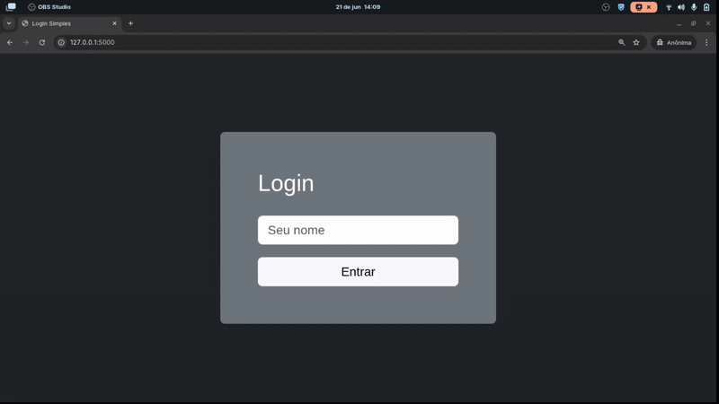

# Fake Login com Flask 

## Executar localmente

**Pre-requisitos**: python >= 3


```bash
python3 -m venv venv

source venv/bin/activate

pip install -r requirements.txt

python app.py
```

[](https://asciinema.org/a/OoVp9HohLiAoJhv2uBEXvOlLG)

Abra o navegador em: http://localhost:5000

